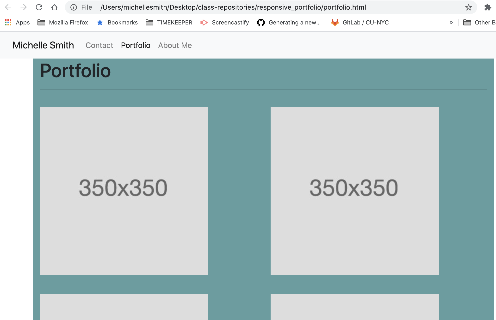

# responsive_portfolio

A link of the website is below.
https://inbtween.github.io/responsive_portfolio/

A screenshot is provided as a reference

Responsive Portfolio design.

I added the following files: `index.html`, `portfolio.html` and `contact.html`.

- Using Bootstrap, I developed my portfolio site with the following items:

  - A navbar

  - A responsive layout

  - Responsive images
